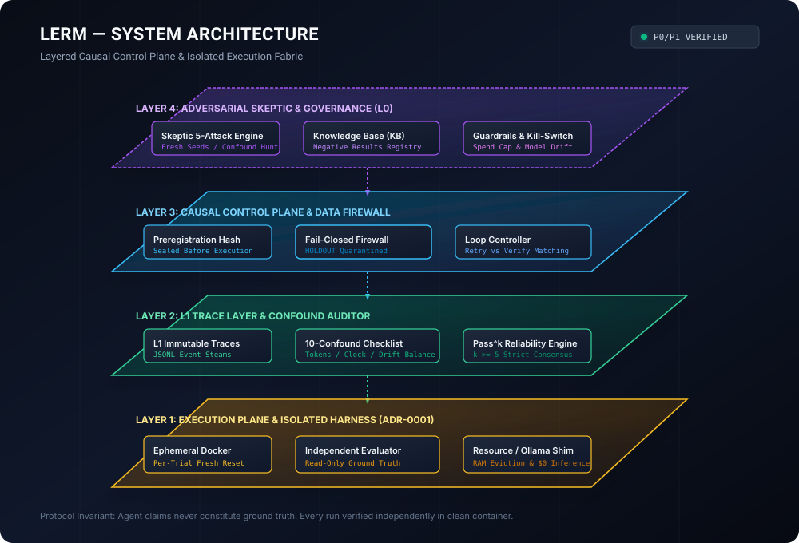
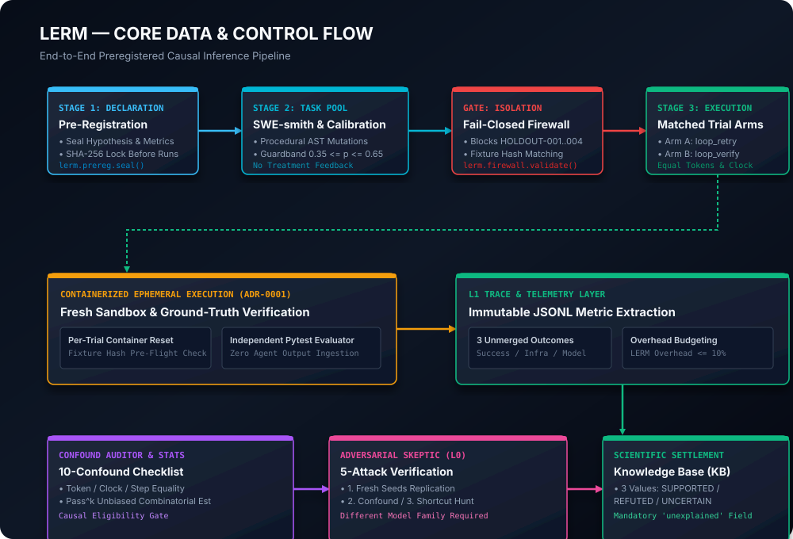
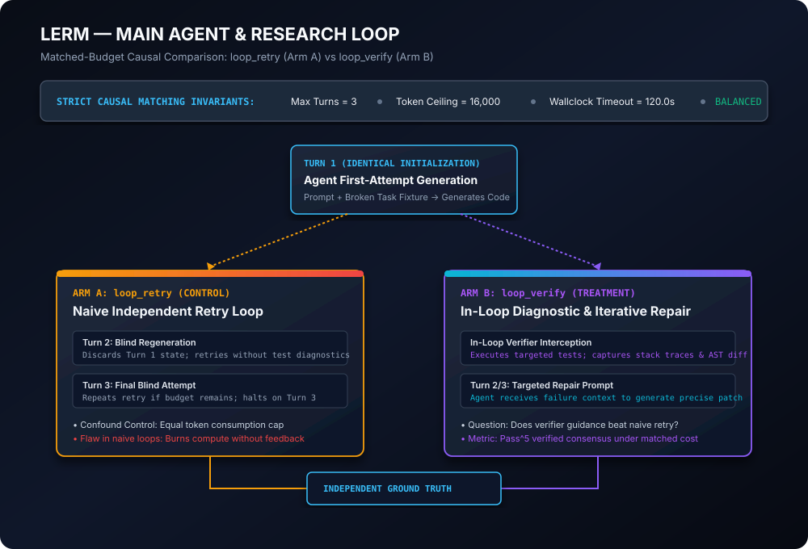
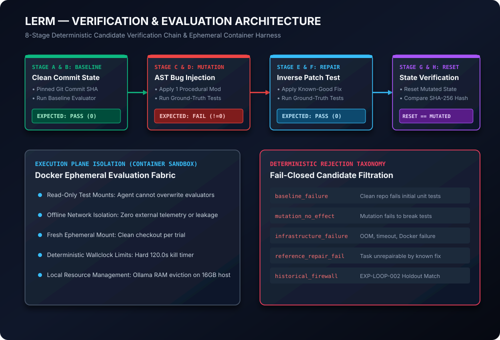
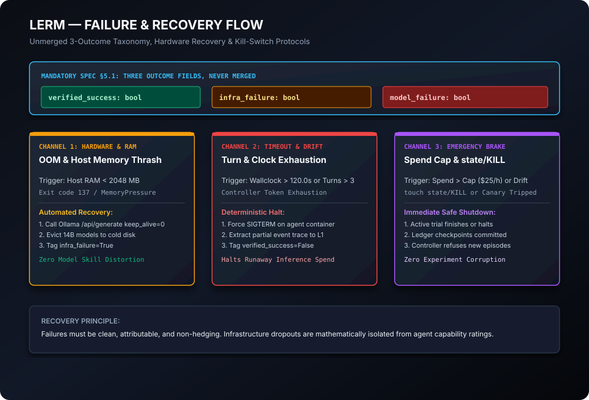
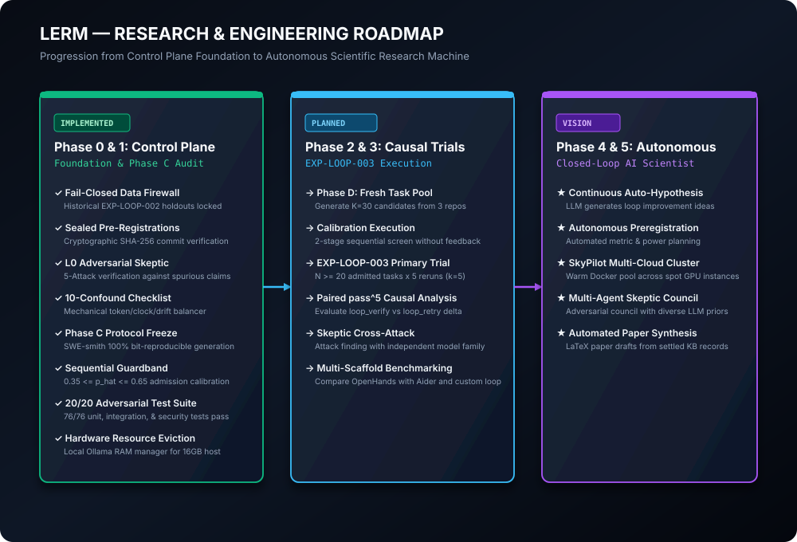

# LERM: Loop Engineering Research Machine

<p align="center">
  
</p>

<p align="center">
  <strong>Causal inference, pre-registered experimentation, and adversarial verification for autonomous software engineering loops.</strong>
</p>

<p align="center">
  <a href="#test-suite"></a>
  <a href="#adversarial-audit"></a>
  <a href="#protocol-freeze"></a>
  <a href="LICENSE"></a>
  <a href="#python"></a>
  <a href="#spend"></a>
</p>

---

## Operating Principle

> **`TRUTH > CAUSAL VALIDITY > INDEPENDENCE > STATISTICAL POWER > REPRODUCIBILITY > THROUGHPUT`**

---

## 1. Executive Summary

Autonomous software engineering agents (e.g. SWE-bench solvers, coding assistants, iterative multi-turn scaffolds) are frequently claimed to be "dramatically improved" by in-loop verification, multi-agent debate, or automated retry loops. However, the majority of published results suffer from severe methodological confounds:
1. **Compute Asymmetry**: Treatment arms consume $2\times$ to $5\times$ more tokens and wallclock time than controls.
2. **Benchmark Leakage**: Public benchmark problems are present in frontier model pre-training corpuses.
3. **Stochastic Cherry-Picking**: Authors report $\text{pass}@k$ (the probability that *any* 1 of $k$ trials succeeded by chance) rather than true deterministic reliability $\text{pass}^k$.
4. **Ungrounded Verifiers**: In-loop verifiers game test fixtures, declare false accepts, or leak solution traces into agent contexts.
5. **Post-Hoc Task Selection**: Tasks are selected or pruned after inspecting model performance, generating manufactured "improvements".

**LERM (Loop Engineering Research Machine)** is an open-source scientific research machine built to enforce end-to-end causal rigor on agent loop evaluations. LERM treats the agent scaffold as an experimental intervention within a randomized controlled trial (RCT) framework.

---

## 2. Research Questions

- **RQ1 (Causal Loop Value)**: Does in-loop verification and repair (`loop_verify`) yield a statistically significant improvement in $\text{pass}^k$ verified success over a compute-matched naive retry baseline (`loop_retry`) under identical turn, token, and wallclock caps?
- **RQ2 (Verifier Dynamics)**: How does the verifier False Accept Rate ($\text{FAR}$) degrade multi-turn repair trajectories on long-horizon software engineering tasks?
- **RQ3 (Automated Scientific Skepticism)**: Can an adversarial auditor ($L0$) from an independent model family refute spurious empirical findings before they enter the research knowledge base?

---

## 3. System Architecture

LERM is structured into four distinct planes separated by strict causal firewalls:

```
┌─────────────────────────────────────────────────────────────────────────────┐
│  LAYER 4: SCIENTIFIC GOVERNANCE & ADVERSARIAL SKEPTIC (L0)                   │
│  • Skeptic 5-Attack Suite • Knowledge Base (KB) • Spend & Drift Guardrails  │
└──────────────────────────────────────┬──────────────────────────────────────┘
                                       │ Pre-reg Verification & Skeptic Review
┌──────────────────────────────────────▼──────────────────────────────────────┐
│  LAYER 3: CAUSAL CONTROL PLANE & DATA FIREWALL                              │
│  • Pre-registration Hasher • Fail-Closed Firewall • Deterministic Controller │
└──────────────────────────────────────┬──────────────────────────────────────┘
                                       │ Matched Arms Dispatch & Isolation
┌──────────────────────────────────────▼──────────────────────────────────────┐
│  LAYER 2: L1 TRACE TELEMETRY & CONFOUND BALANCER                             │
│  • Unmerged 3-Outcome Traces • 10-Confound Checklist • Pass^k Estimator     │
└──────────────────────────────────────┬──────────────────────────────────────┘
                                       │ Ephemeral Container Mounts & Signals
┌──────────────────────────────────────▼──────────────────────────────────────┐
│  LAYER 1: EXECUTION PLANE & CONTAINER SANDBOX (ADR-0001)                     │
│  • Ephemeral Docker Sandbox • Read-Only Pytest Evaluator • Resource Manager │
└─────────────────────────────────────────────────────────────────────────────┘
```

For the complete technical specification, see [`docs/ARCHITECTURE.md`](docs/ARCHITECTURE.md).

---

## 4. Visual Technical Architecture

### 4.1 End-to-End Data & Control Flow
Every experiment proceeds through strict sequential phases: pre-registration declaration, candidate generation with sequential boundary gates, firewalled execution, trace telemetry extraction, 10-dimension confound balancing, adversarial skeptic attack, and settlement into the Knowledge Base.

<p align="center">
  
</p>

### 4.2 Matched-Budget Agent Loop (`loop_retry` vs `loop_verify`)
To attribute effects causally to the loop mechanism rather than compute asymmetry, both arms operate under strictly identical episode budgets (maximum 3 turns, 16,000 tokens, 120.0s wallclock timeout).

<p align="center">
  
</p>

### 4.3 8-Stage Verification & Evaluation Chain
Candidate coding tasks generated via AST mutations must pass an 8-stage verification chain before calibration or admission, guaranteeing that all tasks are clean, semantically broken, repairable, and reversible.

<p align="center">
  
</p>

### 4.4 Failure Classification & Recovery Flow
LERM enforces a non-merged 3-outcome taxonomy (`verified_success`, `infra_failure`, `model_failure`). Hardware out-of-memory events trigger local Ollama model eviction and are mathematically isolated from agent capability ratings.

<p align="center">
  
</p>

---

## 5. Formal Implementation Status

In accordance with scientific integrity, functionality is strictly categorized:

| Component | Status | Description | Code Location | Evidence Reference |
|---|---|---|---|---|
| **Cryptographic Pre-Registration** | `VERIFIED` | SHA-256 sealed experiment manifests; immutable before execution. | [`lerm/prereg.py`](lerm/prereg.py) | Unit tests in `test_core.py` |
| **Fail-Closed Data Firewall** | `VERIFIED` | Mechanically quarantines historical holdouts (`HOLDOUT-001..004`) and copied fixture hashes. | [`lerm/firewall.py`](lerm/firewall.py) | 13/13 tests in `test_firewall.py` |
| **Adversarial Skeptic (L0)** | `VERIFIED` | 5-attack suite refuting spurious findings using independent model families. | [`lerm/skeptic.py`](lerm/skeptic.py) | 7/7 tests in `test_skeptic_planted.py` |
| **10-Dimension Confound Checklist** | `VERIFIED` | Automated validation of tokens, wallclock, attempts, drift, and seed policies. | [`lerm/confounds.py`](lerm/confounds.py) | Verified in `test_skeptic_planted.py` |
| **Unbiased Pass^k Estimator** | `VERIFIED` | Minimum-variance unbiased combinatorial estimator for consensus reliability ($k \ge 5$). | [`lerm/stats.py`](lerm/stats.py) | Verified in `test_core.py` |
| **Task Candidate Protocol** | `VERIFIED` | SWE-smith procedural generation with sequential calibration ($0.35 \le \hat{p} \le 0.65$). | [`lerm/candidate_pool.py`](lerm/candidate_pool.py) | 20/20 in `test_candidate_adversarial.py` |
| **Hardware Resource Manager** | `VERIFIED` | Host RAM monitor with proactive Ollama model eviction for ₹0 / $0 local inference on 16GB RAM. | [`lerm/resource.py`](lerm/resource.py) | Verified via Windows memory API |
| **SWE-smith Bit-Reproducibility** | `VERIFIED` | 100% bit-for-bit reproducible bug generation across 3 independent repository configurations. | [`verify_3_configs_reproducibility.py`](verify_3_configs_reproducibility.py) | Verified in `PHASE_C_AUDIT_REPORT.md` |
| **EXP-LOOP-002 Pilot Run** | `HISTORICAL` | 79 trials completed; uncovered task ceiling effect where Turn 1 solved all tasks. | [`preregistrations/EXP-LOOP-002.yaml`](preregistrations/EXP-LOOP-002.yaml) | Archived in `reports/` |
| **Phase D Primary Candidate Generation**| `PLANNED` | Automated generation of $K=30$ candidate tasks across `addict`, `marshmallow`, `sqlfluff`. | `scripts/` | Frozen under Phase C Protocol |
| **EXP-LOOP-003 Primary Causal Trial** | `PLANNED` | Matched causal execution of $N \ge 20$ tasks $\times 5$ reruns ($k=5$). | `scripts/run_causal_experiment.py` | Ready for execution post-freeze |
| **24/7 Autonomous AI Scientist** | `VISION` | Self-directed closed-loop hypothesis generation, multi-cloud Ray execution, paper draft synthesis. | [`docs/diagrams/06_roadmap_vision_3d.svg`](docs/diagrams/06_roadmap_vision_3d.svg) | Long-term research vision |

---

## 6. Verified Experimental Findings & Negative Results

LERM mandates public documentation of negative results and failed hypotheses:

### 6.1 Finding LE-0001 (Offline Pilot Simulation)
- **Hypothesis**: Independent verification in the loop improves $\text{pass}^5$ verified success more than an equal-compute increase in retries on held-out code repair tasks.
- **Observed Effect**: $+0.175$ [$+0.067, +0.282$], False Accept Rate = $0.051$.
- **Skeptic Verdict**: `UNCERTAIN` (Survives confound search, shortcut hunt, and noise check; flagged for replication on secondary model family).
- **Settlement Record**: [`findings/LE-0001.yaml`](findings/LE-0001.yaml).

### 6.2 EXP-LOOP-002 Empirical Ceiling Audit (Negative Result)
- **Hypothesis**: `loop_verify` outperforms `loop_retry` on held-out tasks `HOLDOUT-001` through `HOLDOUT-004`.
- **Finding**: **Zero treatment variance observed**. Out of 79 valid trials, 100% of successful trials solved on Turn 1 before retry or verification mechanics could engage.
- **Root Cause**: Hand-crafted holdout tasks were too easy for the model (`thinkingmachines/inkling-small:free`), collapsing multi-turn variance.
- **Remediation**: Designed the Phase C Candidate Generation and Sequential Calibration Protocol to enforce $0.35 \le \hat{p} \le 0.65$ single-shot baseline difficulty, guaranteeing that the loop mechanism is exercised.

---

## 7. Adversarial Audit & Security

LERM contains a dedicated 20-vector adversarial test suite (`tests/test_candidate_adversarial.py`) validating that invalid, poisoned, or contaminated tasks are rejected fail-closed:

```text
tests/test_candidate_adversarial.py::TestCandidateAdversarialSuite::test_01_historical_task_injected_into_calibration PASSED
tests/test_candidate_adversarial.py::TestCandidateAdversarialSuite::test_02_historical_task_injected_into_primary PASSED
tests/test_candidate_adversarial.py::TestCandidateAdversarialSuite::test_03_fresh_task_fake_provenance PASSED
tests/test_candidate_adversarial.py::TestCandidateAdversarialSuite::test_04_fresh_task_missing_provenance PASSED
tests/test_candidate_adversarial.py::TestCandidateAdversarialSuite::test_05_fresh_task_altered_provenance PASSED
tests/test_candidate_adversarial.py::TestCandidateAdversarialSuite::test_06_candidate_copied_from_historical_fixture PASSED
tests/test_candidate_adversarial.py::TestCandidateAdversarialSuite::test_07_candidate_one_byte_perturbation PASSED
tests/test_candidate_adversarial.py::TestCandidateAdversarialSuite::test_08_duplicate_mutation PASSED
tests/test_candidate_adversarial.py::TestCandidateAdversarialSuite::test_09_same_mutation_under_different_id PASSED
tests/test_candidate_adversarial.py::TestCandidateAdversarialSuite::test_10_treatment_success_injected_into_metadata PASSED
tests/test_candidate_adversarial.py::TestCandidateAdversarialSuite::test_11_calibration_result_injected_into_generator PASSED
tests/test_candidate_adversarial.py::TestCandidateAdversarialSuite::test_12_candidate_missing_mutation_id PASSED
tests/test_candidate_adversarial.py::TestCandidateAdversarialSuite::test_13_candidate_mismatched_repository_commit PASSED
tests/test_candidate_adversarial.py::TestCandidateAdversarialSuite::test_14_candidate_mismatched_content_hash PASSED
tests/test_candidate_adversarial.py::TestCandidateAdversarialSuite::test_15_candidate_baseline_already_fails PASSED
tests/test_candidate_adversarial.py::TestCandidateAdversarialSuite::test_16_candidate_mutation_produces_no_semantic_failure PASSED
tests/test_candidate_adversarial.py::TestCandidateAdversarialSuite::test_17_candidate_failure_is_infrastructure_only PASSED
tests/test_candidate_adversarial.py::TestCandidateAdversarialSuite::test_18_candidate_reference_repair_does_not_restore_pass PASSED
tests/test_candidate_adversarial.py::TestCandidateAdversarialSuite::test_19_candidate_reset_hash_differs PASSED
tests/test_candidate_adversarial.py::TestCandidateAdversarialSuite::test_20_candidate_generated_with_same_seed_twice PASSED

============================= 20 passed in 0.15s ==============================
```

All 76 unit, integration, and security tests pass cleanly across the suite.

---

## 8. Reproducibility & Quick Start

### 8.1 Prerequisites
- Python 3.9+ (Tested on Python 3.14 on Windows 11 / WSL2)
- Docker Desktop / Engine (required for containerized evaluation)
- Git

### 8.2 Installation
```bash
# Clone the repository
git clone https://github.com/Nia00-glitch/lerm.git
cd lerm

# Install package and core dependencies in editable mode
pip install -e .
```

### 8.3 Configuration
```bash
# Copy example environment configuration
cp .env.example .env

# Edit .env with your local or remote LLM endpoint
# (Works with local Ollama http://127.0.0.1:11434 at zero monetary cost)
```

### 8.4 Verification & Selftest
```bash
# 1. Run complete unit and security test suite (76 tests)
pytest tests/ -v

# 2. Validate holdout tasks against schema
python scripts/validate_tasks.py

# 3. Verify SWE-smith bit-for-bit generation determinism across 3 configurations
python verify_3_configs_reproducibility.py

# 4. Verify pre-registration hash integrity
python -c "from lerm.prereg import verify; print(verify('preregistrations/EXP-LOOP-002.yaml'))"
```

---

## 9. Research & Engineering Roadmap

<p align="center">
  
</p>

### Progression:
1. **Current (Phase 0/1 — Control Plane Foundation)**:
   - Complete pre-registration, data firewall, L1 trace, confound balancing, adversarial skeptic, and Phase C protocol freeze.
2. **Next Milestones (Phase 2/3 — Causal Trials)**:
   - Phase D candidate pool generation across `mewwts__addict`, `marshmallow-code__marshmallow`, and `sqlfluff__sqlfluff`.
   - Sequential calibration without treatment feedback ($0.35 \le \hat{p} \le 0.65$).
   - EXP-LOOP-003 primary trial execution ($N \ge 20$ tasks, $k=5$ reruns) comparing `loop_retry` vs `loop_verify`.
3. **Long-Term Vision (Phase 4/5 — Autonomous AI Scientist)**:
   - 24/7 self-directed research loop generating empirical loop hypotheses, auto-generating pre-registrations, provisioning multi-cloud warm Docker pools, and synthesizing LaTeX manuscripts from settled Knowledge Base records.

---

## 10. License & Citation

Distributed under the [MIT License](LICENSE).

```bibtex
@software{lerm2026,
  author = {Nia00-glitch},
  title = {LERM: Loop Engineering Research Machine — Causal Inference and Adversarial Verification for Autonomous Agent Loops},
  year = {2026},
  url = {https://github.com/Nia00-glitch/lerm}
}
```
